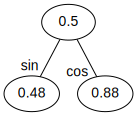

# WIP: graphviz-python
Allows Python code execution inside of [graphviz](https://graphviz.org/) diagrams

## Example
```graphviz
graph python_graph {
{{
import math

value = 0.5
sin = math.sin(value)
cos = math.cos(value)
}}

    A [label="{{= value }}"];
    B [label="{{= sin }}"];
    C [label="{{= cos }}"];

    A -- B;
    A -- C;
}
```

### Output


## Install
Coming soon!
```bash
pip install graphviz-python
```

## Usage
### Using files
```bash
graphviz-python -Tsvg example/example.py.dot -o output.svg
graphviz-python -Tpng example/example.py.dot -o output.png
```

### Using stdin / pipes
```bash
echo 'digraph { A -> B [label="{{= 38 * 73 }}"] }' | graphviz-python -Tsvg > output.svg
```

graphviz-python passes all unknown arguments to graphviz. So you can use all [graphviz arguments](https://graphviz.org/doc/info/command.html).

## Coming soon
- Requested the graphviz-python Pypi name
- Compartibility with asciidoctor-diagram